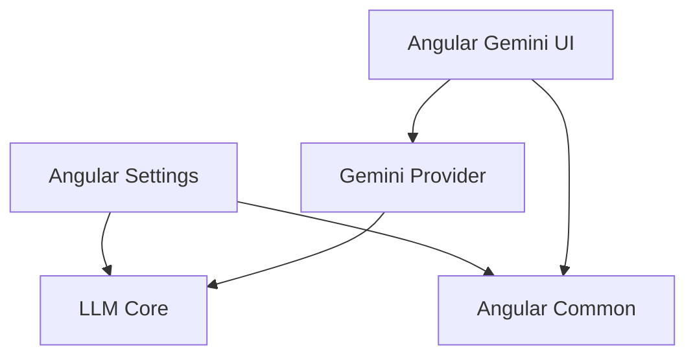

# HCS LLM Provider Monorepo

Professional LLM provider management system, decoupled and modular.

## Structure

### Core (Pure TypeScript)
- `@hcs/llm-core`: Interfaces, Registry, Manager, and base Storage logic.
- `@hcs/llm-provider-gemini`: Google Gemini logic.
- `@hcs/llm-provider-openai`: OpenAI / Compatible logic.
- `@hcs/llm-provider-llama-cpp`: Llama.cpp direct connection logic.

### Angular UI
- `@hcs/llm-angular-common`: Shared tokens (I18n, Portals).
- `@hcs/llm-angular-settings`: The primary settings orchestrator component.
- `@hcs/llm-angular-ui-gemini`: Gemini configuration UI.
- `@hcs/llm-angular-ui-openai`: OpenAI configuration UI.
- `@hcs/llm-angular-ui-llama-cpp`: Llama.cpp configuration UI.

## How to used (Independent Core)

```typescript
import { GeminiProvider } from '@hcs/llm-provider-gemini';
import { LLMProviderRegistry, LLMManager, BrowserIndexedDBStorage } from '@hcs/llm-core';

// 1. Setup Storage & Registry
const storage = new BrowserIndexedDBStorage();
const registry = new LLMProviderRegistry();

// 2. Register Pure TS Providers
registry.register(new GeminiProvider());

// 3. Init Manager
const manager = new LLMManager(storage, registry);

// 4. Use it!
const provider = await manager.getProviderByConfigId('some-guid');
const stream = provider.generateContentStream(config, ...);
```

## How to use (Angular UI)

1. Provide `LLMManager`, `ILLMStorage`, and `LLM_TRANSLATIONS` in your app.
2. In your host component, use `<hcs-llm-settings></hcs-llm-settings>`.
3. Register UI components in the settings component instance using `registerUIComponent`.

## Clean Dependency Tree


